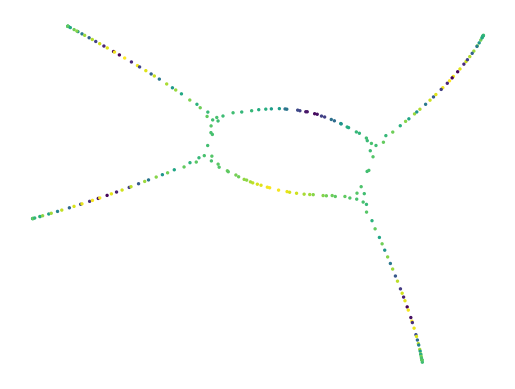
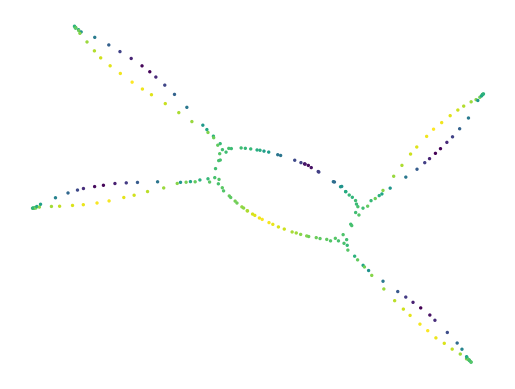

[](https://badge.fury.io/py/lensed-umap)
[](https://github.com/vda-lab/lensed_umap/actions/workflows/Tests.yml)

# Lensed UMAP

Lensed UMAP provides three methods that apply lens-functions to a UMAP model.
Lens functions can be used to untangle embeddings along a particular dimension.
This dimension may be part of the data, or come from another information source.
Using lens functions, analysts can update their UMAP models to the questions
they are investigating, effectively viewing their data from different
perspectives. 

## How to use Lensed UMAP

The lensed UMAP package provides functions that operate on (fitted) UMAP
objects.

```python
import numpy as np
import pandas as pd
from umap import UMAP
import lensed_umap as lu
import matplotlib.pyplot as plt

# Load data and extract lens
df = pd.read_csv("./data/five_circles.csv", header=0)
lens = np.log(df.hue)

# Compute initial UMAP model
projector = UMAP(
    repulsion_strength=0.1,  # To avoid tears in projection that
    negative_sample_rate=2,  # are not in the modelled graph!
).fit(df[["x", "y"]])

# Draw intial model
x, y = lu.extract_embedding(projector)
plt.scatter(x, y, 2, lens, cmap="viridis")
plt.axis("off")
plt.show()
```



```python
# Apply a global lens
lensed = lu.apply_lens(projector, lens, resolution=6)
x, y = lu.extract_embedding(lensed)
plt.scatter(x, y, 2, lens, cmap="viridis")
plt.axis("off")
plt.show()
```




## Example Notebooks

A notebook demonstrating how the package works is available at
[How lensed UMAP Works](https://nbviewer.org/github/vda-lab/lensed_umap/blob/master/notebooks/01_How_lensed_UMAP_works.ipynb). 
The other notebooks demonstrate lenses on several data sets and 
contain the analyses presented in our paper.

## Installing

`lensed_umap`` is available on PyPI:

```bash
pip install lensed_umap
```

## Citing

A scientific publication of this algorithm and codebase is in progress. Please
refer back to this section to see how you can cite this work in the future. 

## Licensing

The lensed UMAP package has a 3-Clause BSD license.
