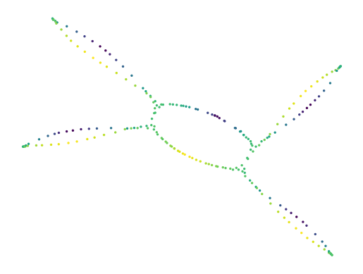

Lensed UMAP 
===========

This :py:mod:`lensed_umap` package provides three methods that apply lens-functions 
to a UMAP model. Lens functions can be used to untangle embeddings along a particular 
dimension. This dimension may be part of the data, or come from another information 
source. Using lens functions, analysts can update their UMAP models to the questions 
they are investigating, effectively viewing their data from different perspectives. 

Usage example:

.. code:: python
    
    import numpy as np
    import pandas as pd
    from umap import UMAP
    import lensed_umap as lu
    import matplotlib.pyplot as plt
    
    # Load data and extract lens
    df = pd.read_csv("./data/five_circles.csv", header=0)
    lens = np.log(df.hue)
    
    # Compute initial UMAP model
    projector = UMAP(
        repulsion_strength=0.1,  # To avoid tears in projection that
        negative_sample_rate=2,  # are not in the modelled graph!
    ).fit(df[["x", "y"]])
    
    # Draw intial model
    x, y = lu.extract_embedding(projector)
    plt.scatter(x, y, 2, lens, cmap="viridis")
    plt.axis("off")
    plt.show()

.. image:: _static/initial_umap.png
    :alt: Initial UMAP model

.. code:: python

    # Apply a global lens
    lensed = lu.apply_lens(projector, lens, resolution=6)
    x, y = lu.extract_embedding(lensed)
    plt.scatter(x, y, 2, lens, cmap="viridis")
    plt.axis("off")
    plt.show()

Contents
--------

.. toctree::
   :maxdepth: 2

   examples
   reference